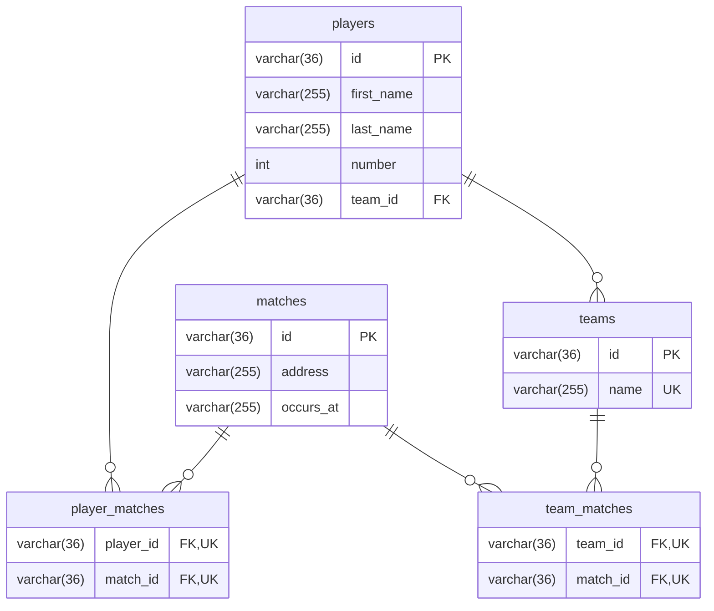

# Match API

This api uses NestJS, GraphQL with GraphQL Relay, TypeORM.

## Running app

To run the app you simply need to run

```sh
docker compose up
```

On Macbook M1, M2, M3, etc. you need to set platform for mysql container.
Uncomment line 10 in [docker compose](./docker-compose.yaml).

For compose you need to add .env file

```env
DB_HOST=match-db
DB_PORT=3306
DB_PASSWORD=root
DB_USERNAME=root
DB_NAME=match

SEED_DATABASE=1
```

`SEED_DATABASE` will add data to your database

There is prepared sql which contains structure and data [sql](match.sql), but it does not contain trigger from [Migration1705242881623](./src/database/migrations/Migration1705242881623.ts).

You should connect to database as root, because there is trigger. When it is created as non-root user, it can cause an error.

## Architecture description

There is only one module, because there are simple GraphQL operations on 3 database models.

Project structure from `src` directory

    .
    ├── modules # contains core module and can contain for example adapter modules
    │   ├── core
    │   │   ├── model # database models
    │   │   ├── repository # repositories with queries to database
    │   │   ├── service # business logic
    │   │   ├── transport # contains GraphQL layer and can contain other transport for instance http ot websocket
    ├── database # contains migrations and database connection
    ├── shared # contains code shared across the application

I made repositories with interfaces and providers, because I want to make separation between ORM and my application. For example if I want to change TypeORM to Sequalize or MikroORM I need to change only implementation of repositories and database folder.

GraphQL is in transport directory, because logic does not need to couple with GraphQL. For instance I want to use REST API, so I can use services which are used by GraphQL transport and I only need to create controllers.

## Database

Database uses MySQL 8.0.26

### Entity relations diagram



Inserting into player_matches is protected by trigger. For example there is Team A with player 1 and player 2. Team A does not play in a match, but someone wants to add player 1 to this match. It causes an error which tells that you cannot add a player to match, when player's Team is not playing in this match.
